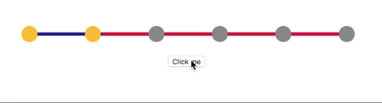

# React Dennis Progressbar
[](https://badge.fury.io/js/react-dennis-progressbar)

A simple and reusable Progressbar 


## Installation

The package can be installed via [npm](https://github.com/npm/cli):

```
npm install react-dennis-progressbar --save
```

Or via [yarn](https://github.com/yarnpkg/yarn):

```
yarn add react-dennis-progressbar
```

You’ll need to install React separately since this dependency isn’t included in the package. Below is a simple example of how to use the Progressbar within React.

```js
import React from 'react';
import ProgressBar from 'react-dennis-progressbar';


class Example extends React.Component {
  state = {
     stepNumber: 6,
  };

  changeStep = e => {
    e.preventDefault();
    this.setState((state) => 
    { 
      return {
        stepNumber: state.stepNumber + 1
      }
    })
  };

  render() {
    return (
      <div>
        <ProgressBar
            stepNumber={this.state.stepNumber}
            steps={[2,6,4,1,5]}
            bullets={true}
        />
        <button onClick={this.changeStep}>Click me</button>
      </div>
    );
  }
}
```

## Configuration & Examples

**The most basic use of the ProgressBar can be described with:**

```js
<ProgressBar stepNumber={6} steps={[2,6,4,1,5]}/>
```


The main formula to calculate and display percentage is:
```js
let calculatedPercentage = Math.round(100 * this.state.stepNumber / [2,6,4,1,5].reduce((a,b) => a+b));
```

**You can use `bullets` to visualize steps and substeps. It will split Progressbar into substeps. The number of bullets will be the length of your steps array + 1.**
```js
<ProgressBar
  stepNumber={6}
  steps={[2,6,4,1,5]}
  bullets={true}
/>
```


**You also have possibility to add custom styles to Progressbar:**
```js
<ProgressBar
  stepNumber={6}
  steps={[2,6,4,1,5]}
  bullets={true}
  bulletColor={{
    active: '#ffc438',
    inactive: '#929292'
  }}
  lineColor={{
    active: '#1c2393',
    inactive: 'rgb(232, 9, 50)'
  }}
  lineHeight={5}
/>
```

## How it works

The main point is your **steps array**. For example: we have the following steps array: *[2,6,4,1,5]*. **If you want to use it without bullets**: depends of your step it will calculate and fill the percentage of how many steps left, automatically. Just pass step.
**If you want to use Progressbar with bullets:** the logic completely the same but with additional points. That each item of steps array will be a bullet, and each value of this item will be a number of substeps. 


## Props Description
Props | Type | Meaning
------------ | ------------- | ------
stepNumber | Number | Number of your current step
steps | Array | Array with steps and substeps. Element is the step itself, and its value is the number of substeps. For example: [3] means that in your steps array you'll have only one step which consists of 3 substeps. 
bullets | Bool | To visualize and split steps and substeps.
bulletColor | Object | Option to style filled and unfilled bullets. Object which accepts two keys: active and inactive. To style both of them, just pass the color into their value. 
lineColor | Object | Object | Option to style filled and unfilled part of line. Object which accepts two keys: active and inactive. To style both of them, just pass the color into their value. 
lineHeight | Number | This value will be applied as height of your Progressbar


## Compatibility

### React

We're always trying to stay compatible with the latest version of React. We can't support all older versions of React.

Latest compatible versions:

- React 16 or newer
- React 15.5
- React 15.4.1


### Browser Support

The Progressbar is compatible with the latest versions of Chrome, Firefox, and IE10+.

## Local Development

The `master` branch contains the latest version of the Progressbar component.

To begin local development:

1. `npm install`
2. `npm start`
3. `npm run build`

The last step starts documentation app as a simple webserver on http://localhost:3000.

You can run `npm run test` to execute the test suite and snapshots.

## License

Copyright (c) 2019 LookerClocker and individual contributors. Licensed under MIT license, see [LICENSE](LICENSE) for the full license.